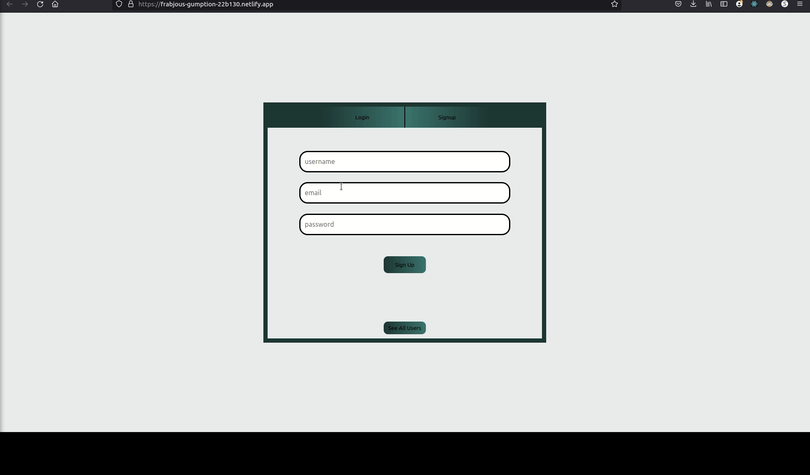

# Simple Full Stack Application

## Objective

* This project served to implement the basic concepts for a sign in form and get familiar with the necessary connections to a fullstack application. It is created using the following technologies:

1. REACTjs for *[Client UI](https://frabjous-gumption-22b130.netlify.app/)*, hosted on Netlify
2. Node.js & Express.js, hosted with firebase
3. MySQL, hosted with AWS RDS

### Sign In Form - Creating a new User

The sign up form is pretty straight forward. It consists of 3 inputs(username, email, password). When creating a new user, it makes an api call via axios to create a new user on the database. Once created you can look for it in the list of users by clicking the "see all users" button



### Login Form

The login form currently does nothing

### Database Schema

```
CREATE TABLE IF NOT EXISTS Users(
	id INT AUTO_INCREMENT PRIMARY KEY,
    username VARCHAR(40) NOT NULL,
    email VARCHAR(100) NOT NULL,
    password VARCHAR(400) NOT NULL,
    salt VARCHAR(400) NOT NULL,
    UNIQUE KEY unique_username (username),
    UNIQUE KEY unique_email (email)
);

ALTER TABLE Users AUTO_INCREMENT = 0;

```